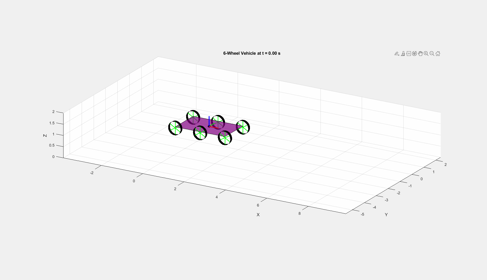
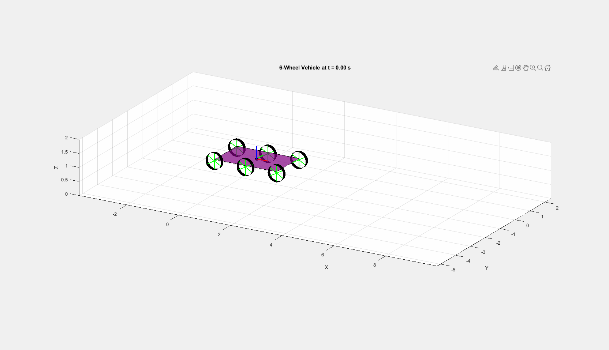

# 🚜 AWID-Vehicle: Six-Wheel All-Wheel Independent Drive Vehicle (MS Thesis)

This repository contains a **symbolic multibody dynamic model** of a **Six-Wheel All-Wheel Independent Drive (AWID) Vehicle**, implemented entirely in MATLAB using the **Lagrangian mechanics framework**. It includes torque-driven dynamics, full kinematics, contact Jacobians, and a 3D animation of the vehicle in motion.

* This project is part of my Master's thesis **Real time torque vectoring control of off-road unmanned ground vehicle with multi complex nonlinear constraints** conducted at Beijing Institute of Technology under the supervision of **Dr. Ma Yue** from 2017 to 2019. It includes dynamic modeling, symbolic derivation, and simulation of a six-wheeled independent drive skid-steering vehicle.

Skid-steered AWID vehicles are highly maneuverable and suitable for extreme terrains but present complex control coordination challenges due to the absence of mechanical transmissions. This work proposes a real-time hierarchical torque vectoring control strategy consisting of:

* Upper controller layer: Generates driving commands replacing conventional steering.

* State estimation layer: Processes sensor data to estimate key vehicle states.

* Lower controller layer: Performs optimal torque distribution among wheel actuators.

The control allocation is formulated as a quadratic programming optimization problem and solved efficiently on embedded platforms using a modified barrier method. The strategy is validated through both computer simulations and experimental tests, demonstrating effective real-time torque vectoring for enhanced vehicle control.

In the thesis, **MATLAB - ADMAS** cosimulation was performed. Here I am trying to develop a **Matlab** model for better control application. 

**Without and With lateral Resistance**
<table>
  <tr>
    <td align="center">
      <br/>
      <b>No Lateral Resistance</b>
    </td>
    <td align="center">
      <br/>
      <b>Lateral Resistance</b>
    </td>
  </tr>
</table>


---

## 📘 Project Overview

- 6 independently actuated wheels (front, middle, rear on both sides)
- Symbolic derivation of the equations of motion using **Euler angles**, **Lagrangian dynamics**, and **Jacobian constraints**
- MATLAB function generation for mass matrix (M), Coriolis/centrifugal vector (C), gravity vector (G), and contact constraints (J, J̇)
- Exported GIF animation of vehicle motion from simulation results

---

## 📐 Model Structure

### 🔧 Generalized Coordinates

The system has 12 generalized coordinates:

- **Chassis (6 DOF):**  
  $[x, y, z]$ — COM position in world frame  
  $[\phi, \theta, \psi]$ — Euler angles (roll, pitch, yaw)

- **Wheel Angles (6 DOF):**  
  $[\theta_1, \dots, \theta_6]$ — Rotation of each wheel

Thus,  
$q = [x, y, z, \phi, \theta, \psi, \theta_1, \theta_2, \theta_3, \theta_4, \theta_5, \theta_6]^T$

---

## 🧠 Dynamic Modeling Using Lagrangian Mechanics

### 1. **Kinetic Energy**

- **Chassis Translation and Rotation:**

$T_\text{body} = \frac{1}{2} m_b (\dot{x}^2 + \dot{y}^2 + \dot{z}^2) + \frac{1}{2} \boldsymbol{\omega}^\top \mathbf{I}_b \boldsymbol{\omega}$

Where $\boldsymbol{\omega}$ is expressed using:

$\omega_\text{body}$ = $T_\text{Euler}$* $\left[ \dot{\phi} \\ \dot{\theta} \\ \dot{\psi} \right]^T$

- **Wheel Kinetic Energy (Translation + Rotation):**

$T_\text{wheels} = \sum_{i=1}^6 \left[ \frac{1}{2} m_w v_i^2 + \frac{1}{2} I_w \dot{\theta}_i^2 \right]$

### 2. **Potential Energy**

$V = m_b g z + m_w g \sum_{i=1}^6 z_{\text{wheel}, i}$

---

### 3. **Lagrangian Equation**

The Lagrangian:  
$L = T - V$

Lagrange's equations for each coordinate $q_i$ are computed as:

$\frac{d}{dt} \left( \frac{\partial L}{\partial \dot{q}_i} \right) - \frac{\partial L}{\partial q_i} = \tau_i$

This results in:

$\mathbf{M(q)} \ddot{\mathbf{q}} + \mathbf{C(q,\dot{q})} + \mathbf{G(q)} = \boldsymbol{\tau}$

Where:  
- $\mathbf{M}$: Mass matrix (12x12)  
- $\mathbf{C}$: Coriolis/centrifugal vector  
- $\mathbf{G}$: Gravity vector  
- $\boldsymbol{\tau}$: Input torques (only for wheels)  

---

## 📏 Contact Constraints

To enforce **non-slipping rolling** and **no vertical penetration**, 2 constraints per wheel are added (rolling and normal direction). These are derived using the **Jacobian matrix** $\mathbf{J}_c$:

$\mathbf{J}_c \dot{\mathbf{q}} = 0 \quad \text{and} \quad \dot{\mathbf{J}}_c \dot{\mathbf{q}} + \mathbf{J}_c \ddot{\mathbf{q}} = 0$

Each wheel contributes:

- Rolling constraint:  
  $\mathbf{e}_{\text{rolling}}^\top \mathbf{J}_i - R \dot{\theta}_i = 0$

- Normal constraint:  
  $\mathbf{e}_{\text{vertical}}^\top \mathbf{J}_i = 0$


We don’t modify 'Jc' directly for damping affected motion (if lateral resistance is to be considered) — instead:

| Feature                           | Add to `Jc` | Add to `τ` (generalized forces) |
| --------------------------------- | ----------- | ------------------------------- |
| Hard constraint (no slip)         | ✅ Yes       | ❌ No                            |
| Soft resistance (viscous damping) | ❌ No        | ✅ Yes                           |


---

### 🧮 Viscous Damping in the Dynamic Model

In the dynamic model, the general form is:

```math
M \ddot{q} + C(q, \dot{q}) + G = \tau + J^\top \lambda
```

To incorporate **viscous damping** (e.g., lateral ground resistance for each wheel), we include an additional damping torque term:

```math
M \ddot{q} + C(q, \dot{q}) + G + \tau_{\text{damping}} = \tau + J^\top \lambda
```

Where the damping torque is given by:

```math
\tau_{\text{damping}} = \sum_{\text{wheels}} J_{\text{lat}, i}^\top \left( -b_i \cdot J_{\text{lat}, i} \dot{q} \right)
```

* $J_{\text{lat}, i}$: Jacobian projecting velocity onto the lateral direction of wheel $i$
* $b_i$: Damping coefficient (viscous resistance) for wheel $i$

This approach **introduces lateral resistance** in a physically consistent way, without violating the structure of the dynamic equations.

---


---

## 📂 Exported MATLAB Functions

Symbolic functions are automatically exported for simulation:

| Function File                     | Description                               |
|----------------------------------|-------------------------------------------|
| `M_matrix_func.m`                 | Mass matrix $\mathbf{M(q)}$                 |
| `C_vector_func.m`                 | Coriolis vector $\mathbf{C(q, \dot{q})}$     |
| `G_vector_func.m`                 | Gravity vector $\mathbf{G(q)}$               |
| `AllLegs_contactRolling_J_and_Jdot.m` | Contact Jacobian $\mathbf{J}_c, \dot{\mathbf{J}}_c$ |

---


## 🎥 Animation

The file `six_wheel_animation.gif` is generated from MATLAB using:

```matlab
frame = getframe(gcf);
im(f_count) = frame;
im2{f_count} = frame2im(frame);
f_count = f_count + 1;

```
---

## 📄 References

If you use this code or theory in your research, please consider citing the following relevant publications:

1. **Hierarchical Control Coordination Strategy of Six Wheeled Independent Drive (6WID) Skid Steering Vehicle**  
   *IFAC 2019*  
   [DOI: 10.1016/j.ifacol.2019.09.010](https://doi.org/10.1016/j.ifacol.2019.09.010)

---

2. **Hierarchical Coordinated Control Distribution and Experimental Verification for Six-Wheeled Unmanned Ground Vehicles**  
   *Proceedings of the Institution of Mechanical Engineers, Part D: Journal of Automobile Engineering, 2020*  
   [DOI: 10.1177/0954407020940823](https://doi.org/10.1177/0954407020940823)

The mass matrix \( \mathbf{M(q)} \) is defined as:

## How to Run  
1. Clone this repository:  
   ```bash
   git clone https://github.com/rajanprasad460/AWID-Vehicle.git
   ```
2. Open MATLAB and navigate to the project folder.  
3. Run:  
   ```matlab
   Car_simulator
   ```
